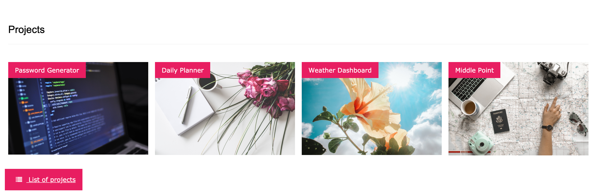
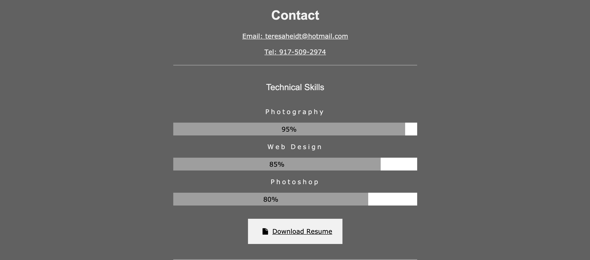

# My Portfolio
## Table of Contents
1. Goals
2. Projects
3. Applications used
4. Imgs
5. Links
## Goals
As an SMU bootcamp student who is getting a certificate in Full Stack Web Developement, I hope to find opportunites as a web developer. 

## Projects
The projects I have linked in my portfolio are; an application to an application called Middle Point, a weather dashboard, password generator and a daily scheduler.
* **Middle Point** - this is an app that allows the user to find the middle point between two locations.
* **Weather Dashboard** - the user can find out what the weather is in any city across America.
* **Password Generator** - a password wil be generated with random letters, numbers and symbols. 
* **Daily Scheduler** - manage a daily calendar that tells you where the user is in the day with color blocking and provides the current date at the top of the page. 

## Applications used
To build my portfolio, I used w3-schools template, html, css, font awesome for styling and javascript.
## Imgs
When the user visits my portfolio, this is the first image they see. Every link takes the user to their desired location. 
 
When the user visits the 'Projects' tab, they will be able to view the top four projects. Each project has an image and a link to the specific project.

When the user clicks on the 'Contact' link, they are able to see how to contact me. The telephone and email listed will enable the user to dynamically call me or email me. The user can also view my resume and find me on Github, LinkedIn and instagram.

## Links
https://github.com/teresaheidt/TH-Portfolio.git

